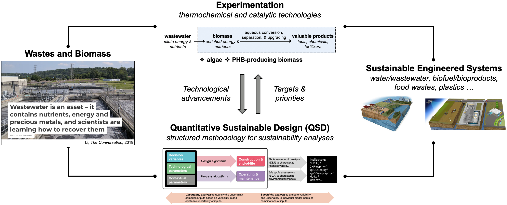

## Research

### Summary

My research seeks to advance the sustainability of engineered systems through experimentation and quantitative sustainable design (QSD) – a systematic approach that integrates concepts associated with sustainability science and engineering. Specifically, I am interested in (i) developing technologies and systems for renewable products from wastes and biomass, and (ii) leveraging the QSD methodology for the research, development, and deployment (RD&D) of technologies and inform decision-making.

 

 

 <i> Overarching scheme of my research. </i> 

---

 

### Experimentation

Toward experimentation, my doctoral research focused on resource recovery from wastewater through biomass (e.g., algae, bacteria for biopolymers). Wastewater-derived biomass can transform contaminants and/or excess nutrients in wastewater into their storage compounds (e.g., lipids, carbohydrates), and I applied multiple technologies (e.g., hydrothermal reactions that happen in hot, compressed water) to convert them into biofuels, fertilizers, and platform chemicals.

---

 

### Quantitative Sustainable Design (QSD)

With the experimental foundation, I am currently leveraging the QSD methodology to guide the RD&D of technologies and inform decision-making. QSD provides a transparent and agile approach to characterize the sustainability of systems using techniques (e.g., techno-economic analysis, TEA; life cycle assessment, LCA) and indicators (e.g., internal rate of return, global warming potential) covering economic, environmental, health, and social dimensions. 

To enable the execution of QSD and inform decision-making, I am leading and contributing to the development of multiple open-source tools (see the section below for more details) for system design, simulation, as well as sustainability characterization (e.g., through TEA and LCA).

With these tools, I am leading the design of spatiotemporally resolved sustainable sanitation systems (resource recovery from excreta) and biorefineries (new bioproducts, high-rate, small-footprint wastewater treatment and energy recovery processes). Further, the wide applicability of the QSD methodology allows me to collaborate with researchers from multiple disciplines (e.g., agronomics, ecosystem, genomics, chemical and metabolic engineering) and characterize the sustainability of interdisciplinary systems, identify gaps and bottlenecks, prioritize research directions, and set explicit targets.

---

 

### Open-Source Tools

#### QSDsan – Quantitative Sustainable Design for Sanitation and Resource Recovery Systems.

 

I am the ***creator & lead developer*** for the QSDsan platform, which is built around the core package QSDsan ([source code](https://github.com/QSD-Group/QSDsan), [documentation](https://qsdsan.readthedocs.io/en/latest), [video demo](https://www.youtube.com/playlist?list=PL-tj_uM0mIdFv72MAULnWjS6lx_cCyi2N)). QSDsan is an open-source tool in Python that integrates system design, simulation, TEA, and LCA under uncertainty. Sanitation systems developed using QSDsan are deposited in the [EXPOsan](https://github.com/QSD-Group/EXPOsan) (exposition) repository, and another package, [DMsan](https://github.com/qsD-Group/DMsan) (decision-making), is leveraged to navigate decision-making among multiple dimensions of sustainability using sustainability indicators simulated in QSDsan with location-specific contextual parameters. Efforts are also underway to develop interactive education modules using the QSDsan platform.

 

#### BioSTEAM – Biorefinery Simulation and Techno-economic Analysis Modules.

I am also a ***core developer*** of the BioSTEAM ([source code](https://github.com/BioSTEAMDevelopmentGroup/biosteam), [documentation](https://biosteam.readthedocs.io)), which is an open-source tool in Python for system design, simulation, and TEA for biorefineries under uncertainty. It has been used in multiple studies to assess the sustainability of novel feedstocks and emerging bioproducts.

---

 

### Grants

#### As PI

- **Connecting Modeling Platforms to Enable High-resolution Field-to-Gate Analysis of Economic and Environmental Sustainability of Bioenergy and Bioproducts. CABBI Director’s Fund, $140 K (*awarded*).**

	- PI: **Yalin Li**; Jeremy Guest (UIUC, USA)
	- Role: The lead PI responsible for proposal preparation and project management, including initiating and coordinating research between four groups (UIUC, West Virginia University, University of Idaho, Oak Ridge National Laboratory).

#### Other contributed grant applications
- **Process Optimization and Real-Time Control for Synergistic Microalgae Cultivation and Wastewater Treatment.
Department of Energy, $2 MM (*awarded*).**

	- PI: Jeremy Guest (UIUC, USA)
	- Role: Conducted preliminary TEA, generated figures, and wrote corresponding proposal sections; coordinated with collaborators at Northeastern University and University at Buffalo, SUNY; provided technical inputs and edited proposal.

- **Hydrothermal Destruction and Modeling of Per- and Polyfluoroalkyl Substances (PFAS) of Sewer Sludge. National Natural Science Foundation of China, $90 K (*awarded*).**
	- PI: Jie Yu (Ningbo University, China); **Y.L. listed as a key participant**
	- Role: Inspired research idea and established modeling method; provided technical input and edited proposal.

- **Accelerating Development of Biogas-Utilizing Microorganisms for Tunable Hydroxyalkanoates and Flexible Production of Fuels and Chemicals. Department of Energy, $2.5 MM (*not funded*).**
	
	- PI: Timothy Strathmann (CSM, USA)
	- Role: Envisioned research idea; drafted majority of technical volume and prepared other technical materials; provided preliminary experimental data and facilitated preliminary TEA; coordinated between five research groups (two from CSM, two from NREL, and one industry partner), and drafted response to comments.

- **Hydrothermal Catalytic Conversion of Waste Lipids to Green Diesel and Its Life Cycle Analyses. National Natural Science Foundation of China, $90 K (*awarded*).**
	
	- PI: Jing Zhang (Chongqing University, China)
	- Role: Provided technical input and edited proposal.

- **From Wastewater to Gasoline – Aqueous Biorefining of Polyhydroxybutyrate (PHB)-Enriched Biosolids.
National Science Foundation, $330 K (*awarded*).**
	- PI: Timothy Strathmann (CSM, USA)
	- Role: Generated preliminary data, wrote project summary and technical sections.