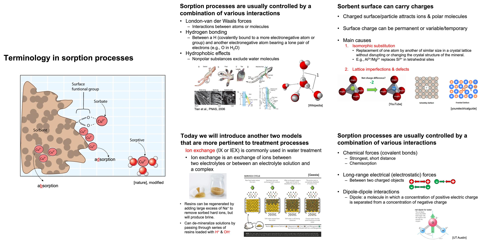
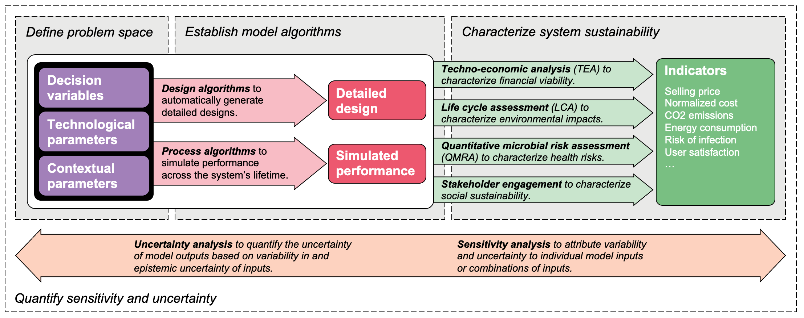

## Teaching

### Course Instructed

#### Environmnetal Engineering Principles, Chemical (UIUC)

The goal of this course is to introduce students to the fundamental principles that govern chemical and biochemical processes in natural and engineered environmental systems, and to employ quantitative approaches to solving aquatic chemistry problems. 

Key course topics include the thermodynamic and kinetic basis for the composition of aquatic systems, chemical equilibrium, acid-base chemistry, aqueous/gas partitioning, alkalinity and pH buffering, metal speciation and precipitation, redox reactions, and sorption processes. Analytical and numerical approaches to solving chemical problems will be illustrated using topics of interest to environmental engineers and scientists.

*Course materials I developed for the sorption module.*

---

 

### Guest Lectures
- Tools for Sustainability (UIUC)
- Water Quality Engineering (UIUC)
- Water and Wastewater Treatment (CSM)

---

 

### Teaching Assistantship
- Water and Wastewater Treatment (CSM)
- Principles of Environmental Chemistry (CSM)

---

 

### Future Course

#### Quantitative Sustainable Design for Engineered Systems

With my interests, experiences, and skills, I would be excited to develop a new course titled Quantitative Sustainable Design (QSD) of Engineered Systems to (i) introduce the concept and method of sustainability design in the context of engineering system design, and (ii) leverage the QSD methodology and the open-source tools in my research for case studies and group projects to engage students with practical applications.

*Leveraging the quantitative sustainable design (QSD) methodology for engineered systems.*

---

 

## Mentoring